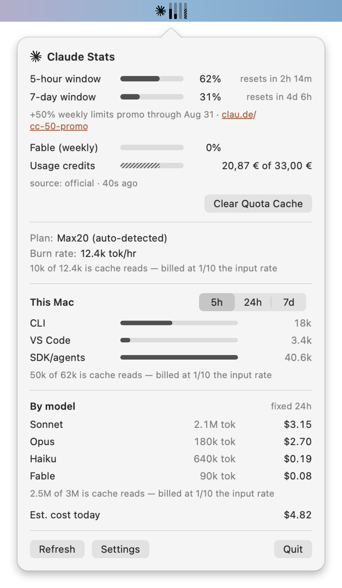

# claude-stats

Menu bar app for macOS showing live Claude token usage. Sibling to
[exelban/stats](https://github.com/exelban/stats). Built with Swift +
SwiftUI, no external dependencies.

In the menu bar it is one glyph — the Claude mark plus a thin bar per limit
(5-hour, 7-day, highest scoped weekly, and usage credits when the account has
any), filled bottom-up. Click it for the popover:

<picture>
  <source media="(prefers-color-scheme: dark)" srcset="assets/screenshot-popover-dark.png">
  
</picture>

## Download

Pre-built releases (macOS app bundle, zipped) are available on the
[Releases page](https://github.com/iwan-uschka/claude-stats/releases).

> **Note:** the app is unsigned — right-click → Open on first launch to bypass Gatekeeper.

> **Note:** move the app to `/Applications` before enabling **Settings → General →
> Launch at login** — the login item records the bundle's location, so
> enabling it from `~/Downloads` and moving it afterwards breaks the entry.

## Features

- Menu bar glyph showing 5-hour and 7-day quota usage plus a per-model weekly limit as three thin bars, tinted for light/dark mode automatically — the third bar is empty when Claude Code reports no scoped limit
- A fourth, hatched bar for organisation usage credits, shown only while Claude Code reports any — most accounts never see it
- Popover with per-window usage and reset countdowns, one row per per-model weekly limit Claude Code reports, and a usage-credits row showing money spent against the monthly cap (`€0.00 of €33.00`, in whatever currency the account is billed in)
- Two matching 30-day blocks with dated axes — **By source** (CLI / VS Code / SDK-agents) stacking tokens, **By model** (Sonnet / Opus / Haiku / Fable) stacking estimated spend — each over a table of that window's tokens and cost per band, with a total the two blocks share
- Estimated spend computed locally from Anthropic's published per-token prices, so on a subscription it is what the usage would have cost, not what was billed
- Hover either chart to read one day back: that block's table swaps its caption for the day's date and every number with it, so a spike gets a figure without a tooltip covering the plot — and hovering one block leaves the other alone
- Local session-log parsing (`~/.claude/projects/*/*.jsonl`) — token counts and cost always available, no network or credentials needed
- Live 5-hour/7-day quota percentage straight from Claude Code's own cached reading — no setup, no hook to install; the `statusLine` hook is optional and just makes it fresher — see [Quota source](#quota-source)
- Account-aware: the quota section is titled with the Anthropic account Claude Code is logged in as (its login email), and any other account this Mac has readings for is listed below it as a collapsed row you can open with a click anywhere on it, marked with a cross against the active account's checkmark — swapping the global login no longer mixes two accounts' numbers
- Claude Code's own rate-limit promo notices, shown below the quota bars they apply to, with any link in them clickable
- FSEvents-driven refresh — updates on write, not on a poll timer

Full architecture and data-source design: see [AGENTS.md](AGENTS.md).

## Quota source

**No setup required.** The popover's 5-hour/7-day percentage bars read Claude
Code's own cached rate-limit numbers out of `~/.claude.json`, which it writes
for itself — tagged `cached` next to the quota title. Run Claude Code
once and the bars fill in. Claude Code refreshes that cache on its own
schedule, so a reading can be an hour or more old; anything older than 60
minutes is treated as stale.

**Optional: sharper freshness.** Claude Code's `statusLine` feature emits the
same rate-limit data the moment it renders a status line, which is seconds old
rather than minutes — but only if something is registered to receive it, and
this app is a menu bar app, not a shell hook, so a small script bridges the
two. Open **Settings → Quota source** and click **Set Up Automatically**: the
app shows the exact before/after change to `~/.claude/settings.json`, backs the
file up, and only edits the `statusLine` key (an existing statusline is
wrapped, not replaced). **Remove** reverts it. Prefer doing it yourself?
**Reveal Script in Finder** and follow the header comment. With the hook
installed and freshly fired, the `cached` tag disappears.

The statusline hook is the primary source and wins whenever it has a fresh
reading; Claude Code's cached reading is the backup, used only when the hook is
missing, failing, or stale. So one of them being quiet is invisible. There is
no estimate fallback: with neither reporting, the popover shows an error rather
than a guessed number, and a real-but-old reading stays on screen with a
terracotta staleness warning. Token counts and cost (from local log parsing) work
regardless.

This tier is account-wide — it reflects usage from other machines/containers
on the same Anthropic account automatically. Which account that is comes from
Claude Code's own `~/.claude.json`, so switching the global login switches the
bars with it; no third-party account switcher is involved.

## Building a release app

```bash
bash make_app.sh 0.1.0
```

This produces `ClaudeStats.app` in the project root — a release binary assembled into a proper macOS app bundle, compiled asset catalog (icon), and ad-hoc signed. Omit the version to take the latest `[x.y.z]` entry from `CHANGELOG.md`.

## Publishing a release

```bash
bash make_release.sh 0.1.0
```

Stamps `CHANGELOG.md`, builds the app, zips it as `ClaudeStats-vX.Y.Z.zip` with a SHA-256 checksum, and prints the `gh release create` command to run.

## Development

```bash
swift build && .build/debug/ClaudeStats
```

Runs straight from the build directory — no bundle, no icon, fastest loop for iterating on code. `swift test` runs the test suite (no UI).

## Status

Early development — [v0.1.0](https://github.com/iwan-uschka/claude-stats/releases/tag/v0.1.0) is out, but settings UI and live quota-source setup are still manual/incomplete.
