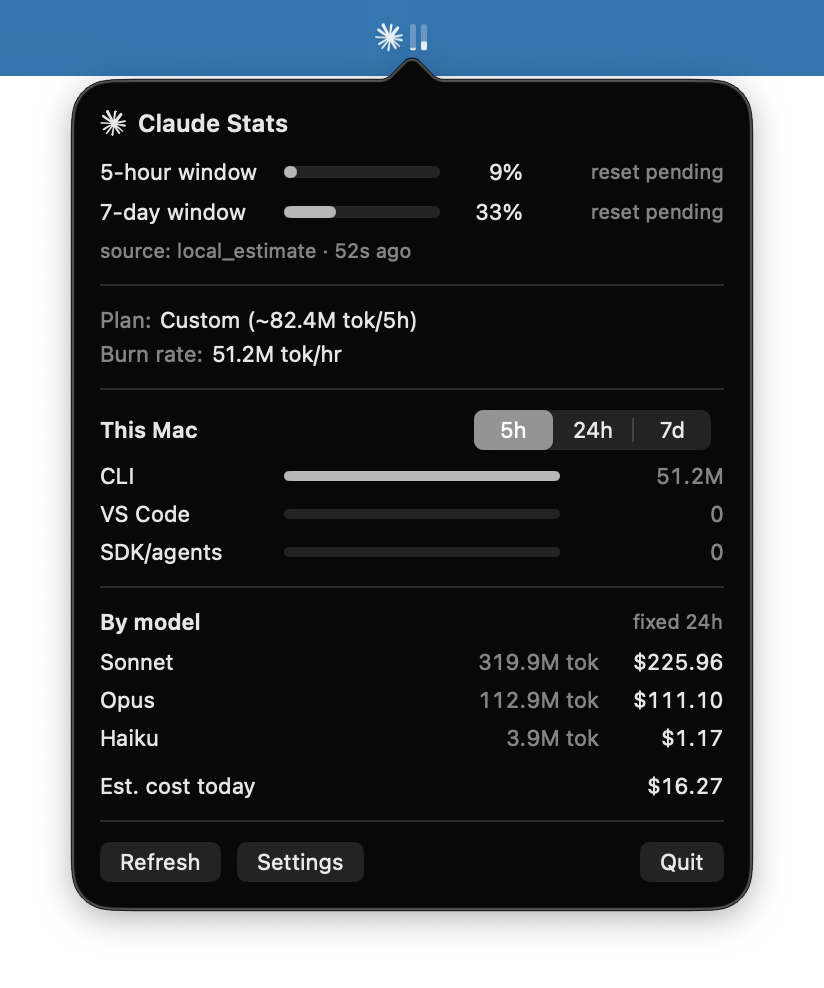

# claude-stats

Menu bar app for macOS showing live Claude API token usage — sibling to
[exelban/stats](https://github.com/exelban/stats).

Lightweight macOS menu bar utility that tracks your Claude token usage in
real time.

## Status

Early development, no releases yet.
